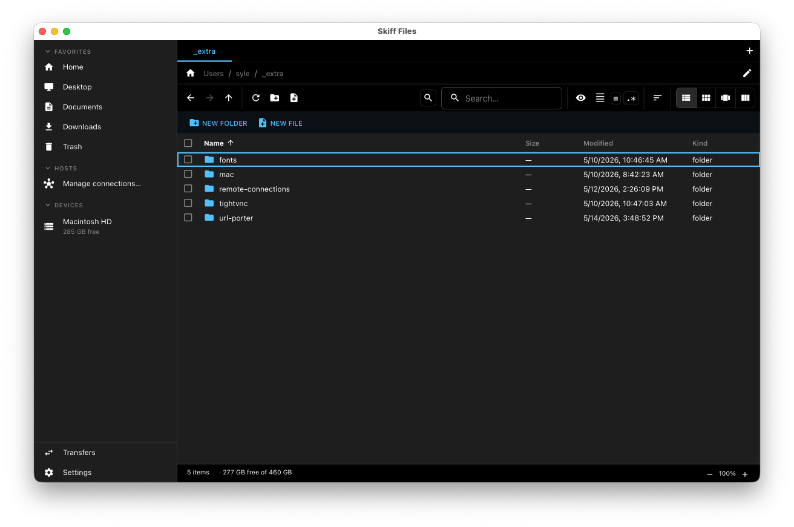
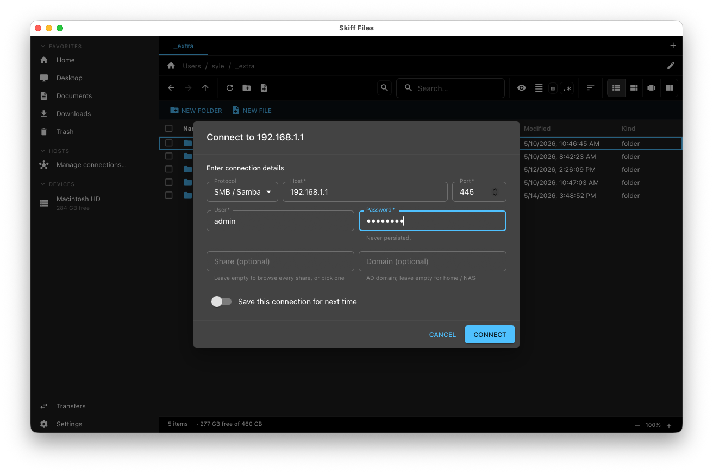
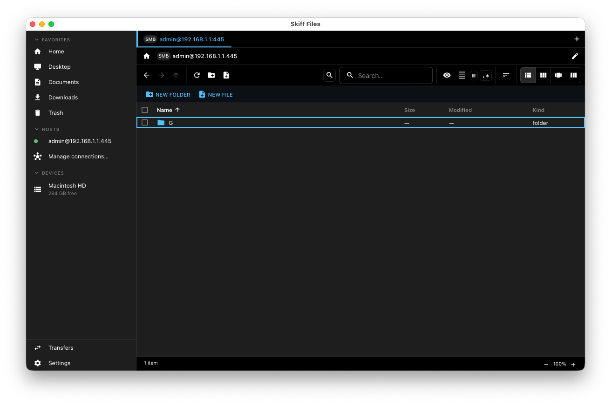
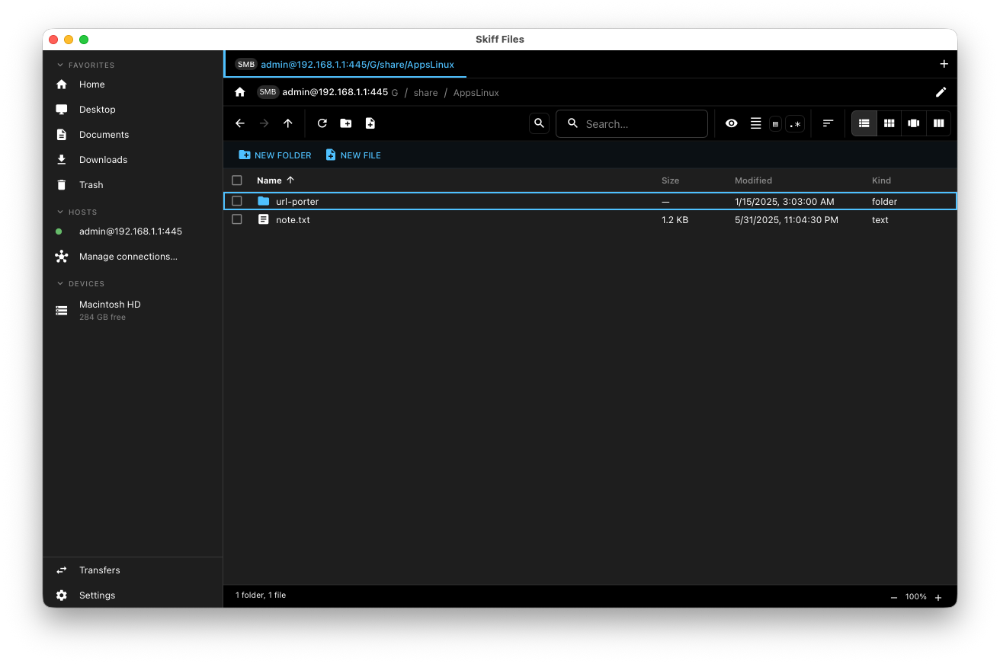
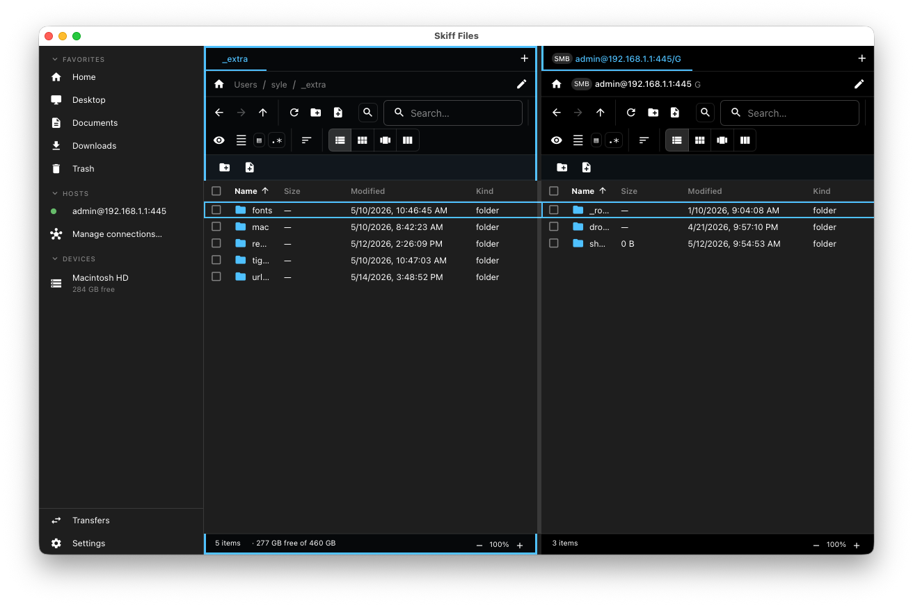
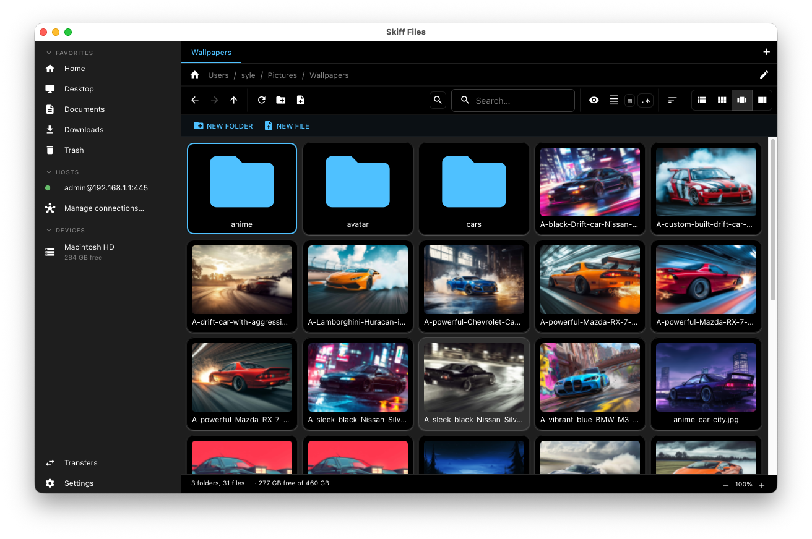
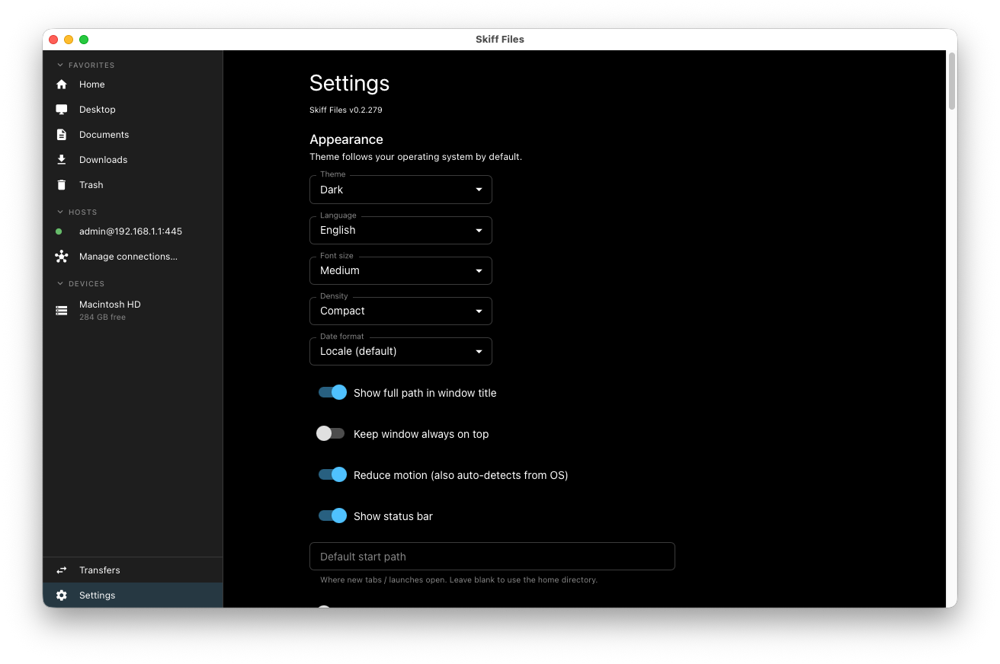

# Skiff Files

A fast, cross-platform desktop file explorer for **Windows / macOS / Linux**, built on **Tauri v2** for a small native bundle.



First-class support for:

- **Local filesystem** with live updates
- **SSH / SFTP** (pure-Rust, no libssh2 build pain)
- **FTP / FTPS**
- **SMB / Samba** (no OS mount required)
- **NTFS** mounts (optional, gated behind a build feature)
- **Skiffsync** — a smart-copy engine inspired by `cpsync` that skips unchanged files across protocols, with progress, ETA, pause/resume, and saved jobs.

## Highlights

- **Familiar UX** — list / tile / gallery / column views, drag-and-drop, breadcrumb path bar, two-pane mode for transfers
- **System theme** — light / dark / auto (follows OS), live-flips on theme change
- **Tiny bundles** — Tauri v2 + pure-Rust protocol clients keep the install < 15 MB
- **Power-user keyboard nav** — every common action has a binding
- **Virtualized lists** — smooth at 100k entries
- **Native trash, native credentials** — `trash` crate for OS trash, `keyring` for Keychain / Credential Manager / Secret Service

## Feature gallery

### Connect to SFTP / FTP / SMB hosts

One dialog covers every remote protocol. Pick the scheme, enter host + credentials, optionally remember the password (stored in the OS keychain — macOS Keychain, Windows Credential Manager, or Linux libsecret). Share field on SMB is optional — leave it empty to browse every disk share on the server.



### Browse remote drives like local folders

Once connected, the remote shows up under **Network** in the sidebar with a protocol chip. All the same actions you have on a local folder work on the remote: New folder, New file, Copy / Cut / Paste, Compress, Rename, Delete, Drag-and-drop. Skiffsync handles cross-protocol transfers natively.



### Deep folders, same speed

Virtualized lists stay smooth even in folders with thousands of entries. The breadcrumb path bar carries a protocol chip + friendly connection label so deep paths stay readable. Click any segment to jump back; right-click to copy.



### Two-pane transfers

Cmd/Ctrl+\\ opens a second pane side by side — perfect for FileZilla-style drag transfers between local and remote, between two remotes, or just between two folders on the same host. Each pane keeps its own tabs, history, sort, and selection.



### Gallery view for media folders

List / tile / gallery / column views are toggleable per folder. Gallery view kicks thumbnails through a SQLite-backed cache so re-visits stay instant.



### Settings everywhere

System theme follows your OS by default; flip it explicitly to Light / Dark, change font size or density, pick a language, override the start path, toggle the status bar. Everything persists across launches in `settings.json` under your OS app-data directory.



## Requirements

| Tool | Version | Notes |
|------|---------|-------|
| Node.js | 20+ | Use `fnm` / `nvm` |
| npm | 10+ | Ships with Node |
| Rust | stable | `rustup default stable` |
| Tauri prereqs | — | See [tauri.app prerequisites](https://tauri.app/start/prerequisites/) |

Platform extras:

- **macOS**: Xcode Command Line Tools (`xcode-select --install`)
- **Windows**: Microsoft C++ Build Tools, WebView2 (preinstalled on Win11)
- **Linux**: `libwebkit2gtk-4.1-dev libappindicator3-dev librsvg2-dev patchelf libxdo-dev libssl-dev`

## Getting started

```bash
git clone git@github.com:synle/skiff-files.git
cd skiff-files
npm install
npx tauri dev
```

For deeper dives:
- **[DEV.md](./DEV.md)** — local setup, day-to-day commands, project layout
- **[ARCHITECTURE.md](./ARCHITECTURE.md)** — how the major modules fit together
- **[TODO.md](./TODO.md)** — phased roadmap + deferred backlog
- **[CLAUDE.md](./CLAUDE.md)** — guidance for Claude Code working in this repo

Useful scripts:

```bash
npm run dev            # Vite dev server only (browser mode at http://localhost:1420)
npm run build          # Production frontend build (tsc + vite)
npm test               # Run Vitest tests once
npm run test:watch     # Vitest in watch mode
npm run typecheck      # tsc --noEmit
npm run tauri:build    # Production desktop build (.dmg/.exe/.deb/.AppImage)
cd src-tauri && cargo test  # Run Rust tests
```

## Project layout

```
.
├── src/                    # React frontend (TypeScript + MUI v9)
│   ├── components/         # Shared UI
│   ├── pages/              # Route-level components
│   ├── test/               # Vitest setup (mocks Tauri APIs)
│   ├── App.tsx             # Routes
│   └── main.tsx            # Entry, ThemeProvider + HashRouter
├── src-tauri/              # Rust backend
│   ├── src/lib.rs          # Tauri commands
│   ├── build.rs            # Exposes APP_VERSION at compile time
│   ├── tauri.conf.json     # Single source of truth for version + window config
│   └── capabilities/       # Tauri permissions
├── TODO.md                 # Phased implementation plan
├── vite.config.ts
└── .github/workflows/      # build / release-official / release-beta
```

## Versioning & release

The version lives in **`src-tauri/tauri.conf.json` → `version`**. `build.rs` exposes it as `APP_VERSION` so Rust code can `env!("APP_VERSION")`. Dev builds append `[DEV]`; CI release builds set `TAURI_RELEASE=true` for a clean version.

- **Build CI** (`.github/workflows/build.yml`) — runs on every push/PR to `main`, tests + builds on macOS (ARM + Intel), Windows, Linux. PRs get a comment with download links.
- **Official release** (`.github/workflows/release-official.yml`) — triggered by pushing a `v*` tag, or manually via `workflow_dispatch`.
- **Beta release** (`.github/workflows/release-beta.yml`) — manual `workflow_dispatch`, takes an optional commit SHA.

## License

MIT
